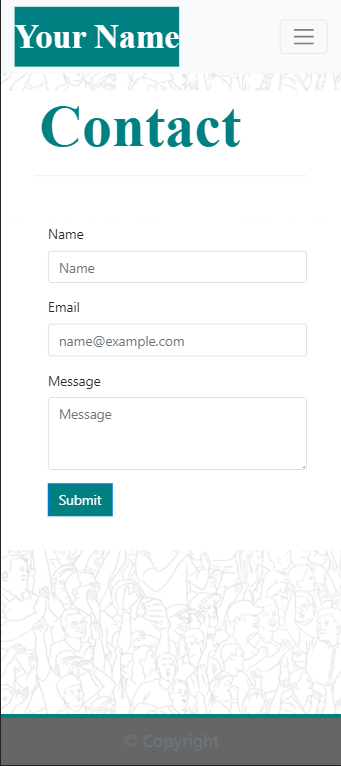

# Portfolio

* [Description](#Description)
* [Technologies Utilized](#Technologies-Utilized)
* [Portfolio Link](#Portfolio-Link)
* [Contact](#Contact)
* [License](#License)

## Description
My Portfolio is a contains pages, Home, Education, Portfolio, KiwiCodes, Architecture, Hobbies and Contact.

* Home contains personal information including Brand Statement, and Bio.
* Education contains degrees and Resume.
* Portfolio contains 7 IT projects, 6 web based and 1 .net.
* KiwiCodes contains information about, and links to key webages and downloads.
* Architecture contains a blurb about my architecture career to date. Plenty to add here.
* Hobbies containssome images of recently completed 3D prints.
* Contact contains personal media links and working contact section.
* Footer contains links to media links, linkedin, twitter, facebook, and github.

Examples of the pages prior to personalization.

 

## Technologies Utilized

The pages use responsive design to ensure that the pages render well on a variety of devices and window or screen sizes; 992, 768 and 400. 

Primary technologies:
* Javascript
* Bootstrap 4.5.2
* HTML-5
* CSS-3

## Portfolio Link

* Please find my portfolio page here: <a href="https://chrisjmckeown.github.io/Portfolio/" target="_blank">Portfolio</a>

## Contact

* Please contact me at: chris.j.mckeown@hotmail.com

## License

* See license here: <a href="https://github.com/chrisjmckeown/Portfolio/blob/master/LICENSE" target="_blank">license agreement</a>