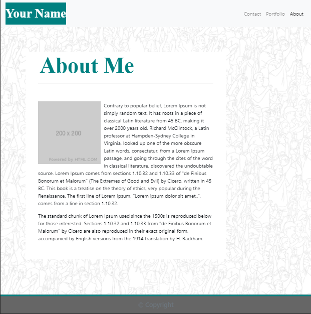
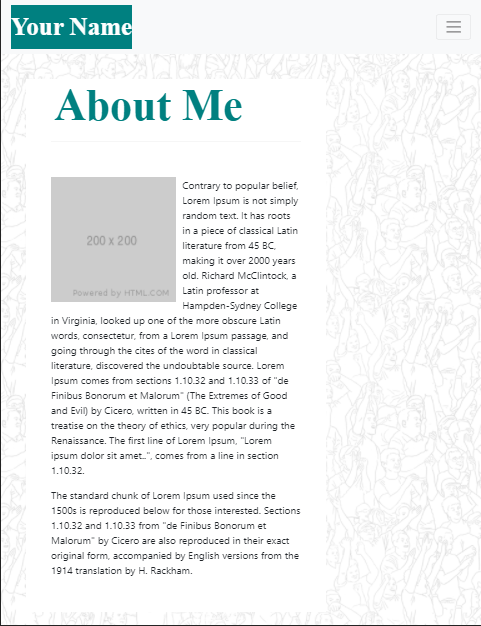
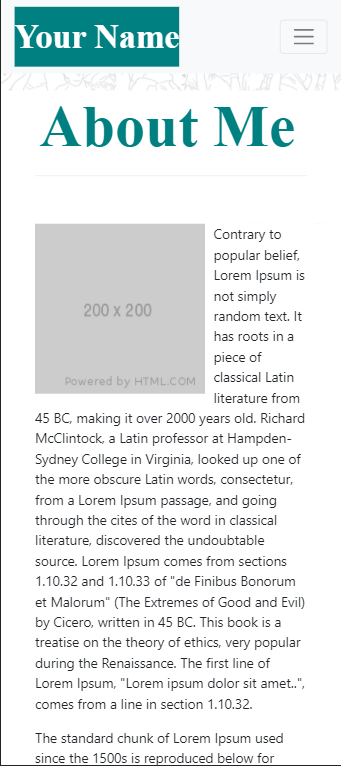
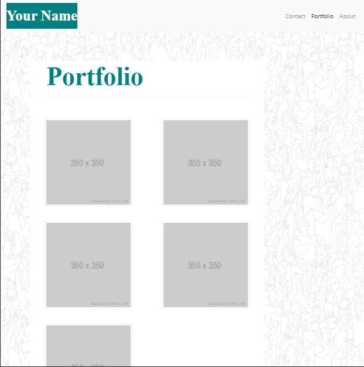
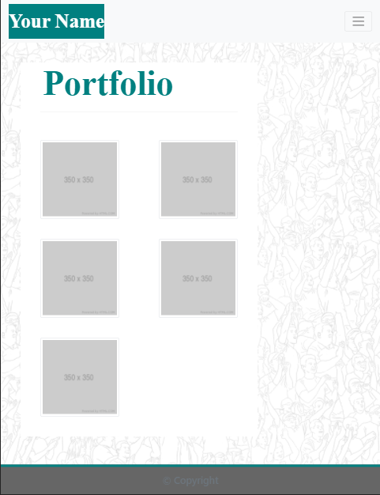
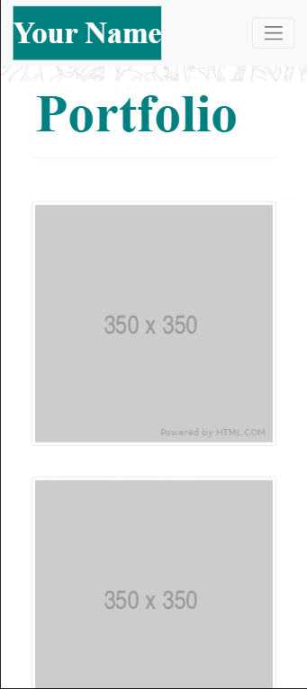
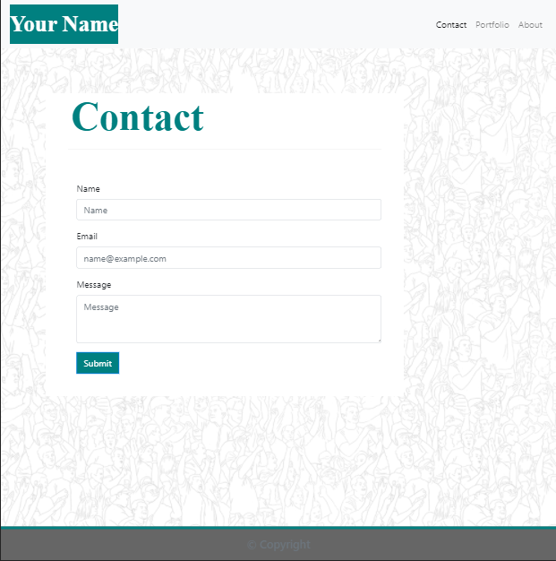
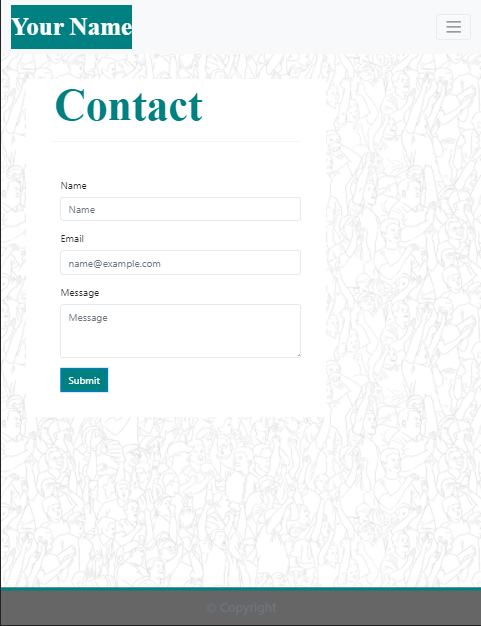

# Portfolio

* [Description](#Description)
* [Technologies Utilized](#Technologies-Utilized)
* [Portfolio Link](#Portfolio-Link)
* [Contact](#Contact)

## Description
My Portfolio is a contains 3 pages, About Me, Portfolio and Contact.

* About Me is a personal Bio including About, Career and Hobbies.
   * Career contains links to personal company webpage and technologies utilized.
   * About Me contains links to Hobby pages.
* Portfolio some images of recently completed 3D prints.
* Contact, a mockup contact page.
* Footer contains links to media links, linkedin, twitter, facebook, and github.

Examples of the pages prior to personalization.

| 992 wide screens and wider  | 768 wide screens and wider | 400 wide screens and wider |
| ------------- | ------------- | ------------- |
|   |   |   |
|   |   |   |
|   |   |  |

## Technologies Utilized

The pages use responsive design to ensure that the pages render well on a variety of devices and window or screen sizes; 992, 768 and 400. 

The page use the Bootstrap CSS Framework and show case a navbar, and responsive layout and images.

Primary technologies:
* Bootstrap 4.5.2
* HTML-5
* CSS-3

## Portfolio Link

* Please find my portfolio page here: <a href="https://chrisjmckeown.github.io/BC_Week_02_CSS_and_Bootstrap_Responsive/" target="_blank">CSS and Bootstrap Responsive</a>

## Contact

* Please contact me at: chris.j.mckeown@hotmail.com